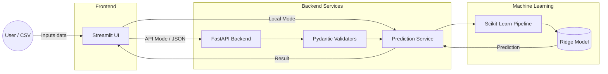

# 🎓 Student Performance Predictor (End-to-End ML Pipeline)

[](https://student-performance-predictor-ap.streamlit.app)
[](https://student-performance-prediction-8xv5.onrender.com/docs)
[](#run-with-docker-recommended-for-mlops)
[](#tech-stack--engineering-highlights)
[](#testing)

An end-to-end Machine Learning project that predicts a student's exam score based on academic, lifestyle, family, and school-context features. This project is built as a portfolio piece to demonstrate **Software Engineering for Machine Learning (MLOps)**, featuring a modular architecture, strict input validation, automated testing, and containerized deployment.

### 🌟 Live Demo
* **Frontend (Streamlit Cloud):** [student-performance-predictor-ap.streamlit.app](https://student-performance-predictor-ap.streamlit.app)
* **Backend API Docs (Render):** [student-performance-prediction-8xv5.onrender.com/docs](https://student-performance-prediction-8xv5.onrender.com/docs)
  *(Note: Render free tier may take ~30s to wake up on the first request).*

---

## 🏗 System Architecture

This project supports two inference modes: Local Mode (direct model loading) and API-backed Mode (via REST API).



## 🛠 Tech Stack & Engineering Highlights

- **Backend & API:** FastAPI, Uvicorn, Pydantic (Strict input schema validation)
- **Frontend:** Streamlit (Multi-page app with single & batch CSV prediction)
- **Machine Learning:** Scikit-Learn (Ridge Regression, Pipeline, ColumnTransformer)
- **Deployment & DevOps:** Docker, Docker Compose, Streamlit Cloud, Render
- **Quality Assurance:** Pytest (Unit testing for API and Inference flows)
- **Serialization:** joblib
- **Optimization:** Utilizes **FastAPI Lifespan Events** for efficient, singleton ML model loading.

## ✨ App Features

- Multi-page Streamlit user interface.
- Single student prediction from an interactive profile form.
- Preset profiles for quick testing without manual input.
- Batch prediction from uploaded CSV files.
- Downloadable CSV input template for batch uploads.
- Input schema and value validation with clear error messages.
- Prediction bands: `Excellent`, `Very Good`, `Good`, `Average`, and `Needs Improvement`.
- Rule-based recommendations tailored to the current prediction.
- Ridge coefficient-based model insight page (Explainability).
- Project Details page for dataset overview, pipeline info, artifacts, and limitations.
- Optional API-backed Streamlit inference through `API_BASE_URL`, with automatic local inference fallback.

## 🚀 Quick Start

### Option 1: Run with Docker (Recommended for MLOps)
You can spin up both the FastAPI backend and Streamlit UI in isolated containers using Docker Compose.

```bash
# Clone the repository
git clone https://github.com/AnhPhiNe/student-score-predictor.git
cd student-score-predictor

# Build and start the containers
docker compose up -d --build
```
- Streamlit UI will be available at: `http://localhost:8501`
- FastAPI Docs will be available at: `http://localhost:8000/docs`

### Option 2: Run Locally (Virtual Environment)
```bash
# Create and activate a virtual environment
python -m venv .venv
# Windows: .\.venv\Scripts\Activate.ps1
# Mac/Linux: source .venv/bin/activate

# Install dependencies
pip install -r requirements.txt

# Start the FastAPI backend
uvicorn api.main:app --reload

# In a new terminal, start the Streamlit App 
# (Set API_BASE_URL to use the API-backed mode)
# Windows: $env:API_BASE_URL="http://127.0.0.1:8000"
# Mac/Linux: export API_BASE_URL="http://127.0.0.1:8000"
streamlit run app.py
```

## 🧪 Testing
The project includes a robust test suite using `pytest`.
```bash
# Run all tests
python -m pytest tests/
```

## 📊 Dataset & Model
* **Dataset:** [Student Performance Factors](https://www.kaggle.com/datasets/lainguyn123/student-performance-factors) (Kaggle, CC0: Public Domain). 6,607 rows, 20 columns.
* **Problem:** Supervised Regression (Target: `Exam_Score`).
* **Model Pipeline:** Validation → Preprocessing → Train-only feature selection → Ridge Regression → Clipped score → Score band mapping.
* **Holdout Performance:** R² = 0.824, MAE = 0.43, RMSE = 1.53.

> Because the source dataset is already structured and relatively clean, this project focuses on **end-to-end ML engineering**, inference consistency, validation, deployment, and portfolio-ready productization rather than heavy raw data cleaning.

## 🔌 API Endpoints

The FastAPI backend is a stateless inference service that reuses the same saved sklearn pipeline and prediction service as the Streamlit app.

| Method | Endpoint | Description |
|--------|----------|-------------|
| `GET` | `/` | Service status and docs pointer |
| `GET` | `/health` | Health check |
| `GET` | `/metadata` | Model metadata (params, metrics, features) |
| `POST` | `/predict` | Single student profile prediction |
| `POST` | `/batch-predict` | Batch prediction from JSON payload |
| `POST` | `/batch-predict-csv` | Batch prediction from CSV file upload |

Interactive API documentation is available at [`/docs`](https://student-performance-prediction-8xv5.onrender.com/docs) (Swagger UI).

## 📁 Folder Structure (Modular Design)
```text
.
├── api/                  # FastAPI application & Pydantic schemas
├── src/                  # Core ML inference logic, validators, & artifact loaders
├── pages/                # Streamlit multi-page UI components
├── models/               # Serialized .joblib models and metadata
├── notebooks/            # EDA & Training exploration
├── scripts/              # Production training script
├── tests/                # Pytest unit tests
├── assets/               # CSS styles
├── Dockerfile.api        # Backend container spec
├── Dockerfile.ui         # Frontend container spec
├── docker-compose.yml    # Container orchestration
├── requirements.txt      # Python dependencies
└── app.py                # Streamlit entry point
```

## ⚠️ Limitations
- Predictions are correlational and should not be treated as causal explanations.
- The dataset may not generalize to every school system or student population.
- The dataset is public and educational; it is not a verified production school information system dataset.
- The app is designed for demonstration, not high-stakes academic decisions.
- Local explanations such as SHAP are not part of the current deployed app.

## 🔮 Future Improvements
- Add CI/CD pipelines (GitHub Actions) to run `pytest` automatically on pull requests.
- Integrate SHAP or LIME for granular local explainability per prediction.
- Add optional demo screenshots or a short GIF walkthrough in the README.
- Add more validator edge-case tests if the input schema changes.
- Move the API to a paid instance or implement a keep-alive ping if low-latency cold starts become critical.

## 📝 License
This project is open-source under the MIT License. Data used is CC0 (Public Domain).
